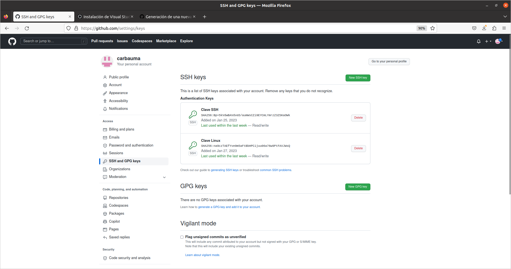
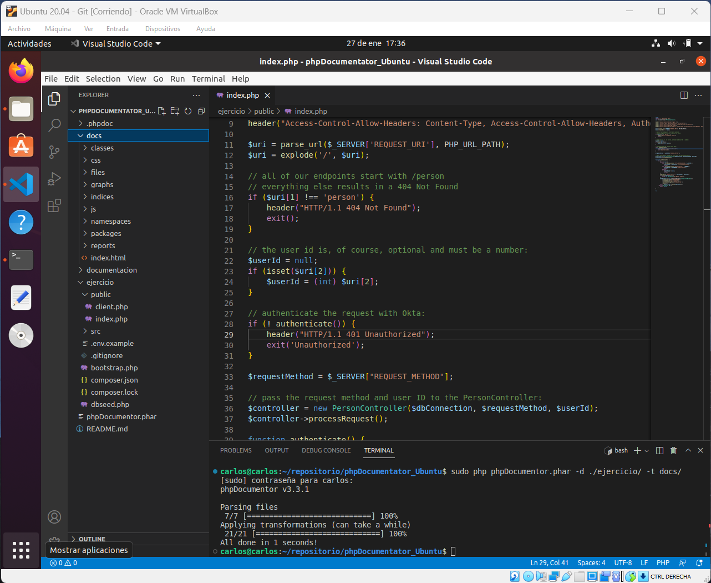

# phpDocumentor_Ubuntu

# Pasos para generar documentación con phpDocumentor

En primer lugar he creado una nueva MV con el SO **Ubuntu 20.04**

A continuación, he actualizado los paquetes, **sudo apt update**

Luego he instalado las siguientes aplicaciones:

* Apache2 
```
sudo apt get install apache2
```
* php 7.4
```
sudo apt install php7.4 
```
* git
```
sudo apt install git
```
* Visual Studio Code (
[Instalación como paquete deb](https://www.robertoserrano.pro/blog/instalacion-de-visual-studio-code-en-ubuntu-20-04/))

Una vez hecho esto, generamos una clave ssh:
```
ssh-keygen -t ed25519 -C "your_email@example.com"
```
Copiamos el contenido del archivo .pub
```
nano /root/.ssh/id_ed25519.pub
```
Pegamos el contenido en GitHub



Clonamos el repositorio del profesor con el ejercicio
```
git clone git@github.com:msanchez07/phpDocumentator.git
```

Ahora creamos un repositorio en github y lo clonamos 
```
git clone git@github.com:carbauma/phpDocumentator_Ubuntu.git
```

Hacemos un, copia y pega, de la carpeta **ejercicio** de phpDocumentor a phpDocumentor_Ubuntu

Ahora hacemos un push con el comentario, y ya tenemos en nuestro propio repositorio el ejercicio subido
```
git add .
git commit -m "Creación de la documentación de un proyecto php"
git push origin main
```

Vamos a instalar PhpDocumentor para generar la documentación

Simplemente descargamos el fichero **phar** y lo guardamos a la altura de la carpeta ejercicio dentro de phpDocumentor_Ubuntu

[Instalación PhpDocumentor](https://docs.phpdoc.org/guide/getting-started/installing.html)

Ahora simplemente queda generar la documentación. Primero crearemos la carpeta docs con **mkdir docs** y luego haremos lo siguiente:
```
sudo php phpDocumentor.phar -d ./ejercicio/ -t docs/
```
Nos pedira la clave de ssh que habiamos generado previamente.

En este momento se ha generado automáticamente toda la documentacion dentro de la carpeta docs.



Vamos a proceder a cargarlo todo al repositorio de GitHub. Para ello lo guardaremos todo y haremos lo siguiente:

```
sudo git status
sudo git add .
sudo git status
sudo git commit -m "comentario"
sudo git push -u origin main
```

Y esto es todo!


---
<!-- A partir de aqui todos los comandos que he aprendido -->

# Documentación para desplegar la aplicación
## Titulo h2
### Titulo h3
#### Titulo h4
##### Titulo h5
###### Titulo h6

<!-- comentario -->

esto es *italic*

esto es **negrita**

<!-- Lista desordenada -->
* naranja
    * rojo
        * rojo
* verde
* azul

<!-- lista ordenada -->
1. naranja
    1. rojo
2. azul
3. verde

<!-- enlaces -->
[google.com](https://www.google.com)

[google.com](https://www.google.com "Etiqueta 1")

<!-- citas -->
> Cita

---
___

`console.log('Hello world')`

```javascript
document.getElementById("demo").innerHTML = "Hello Dolly!";
```

```html
<h1>Hola</h1>
```

<!-- Imagenes -->


<!-- GITHUB MARKDOWN -->
* [x] tarea 1
* [] tarea 2
* [] tarea 3


